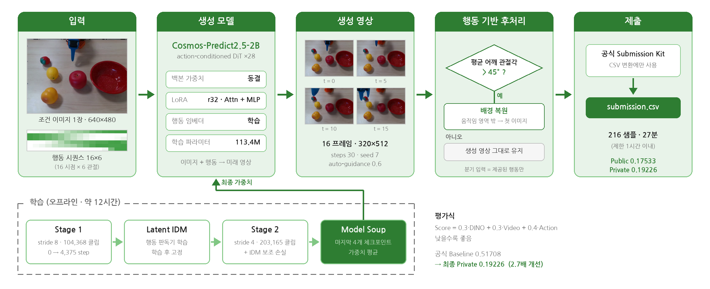
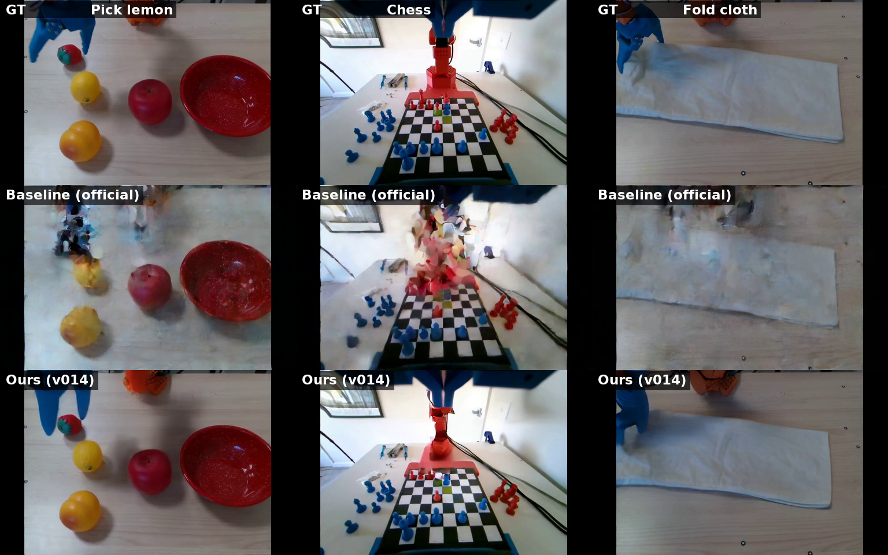
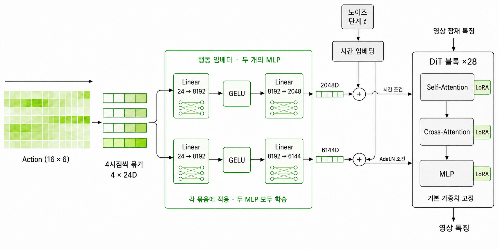

# 로봇 미래 행동 영상 생성 : 월드 모델 챌린지



현재 로봇 이미지 **1장**(640×480)과 앞으로 수행할 **행동 시퀀스**(16×6)를 입력받아,
그 행동을 따라 움직이는 **미래 영상 16프레임**을 생성하는 2026 인하 인공지능 챌린지 **대학원생 트랙 2위(최우수상) 솔루션**입니다. · 팀 `최후의 18시간`

<p align="center">
  
  <br>
  <em>위: 정답 · 가운데: 공식 Baseline · 아래: 제출 모델 — <a href="assets/qualitative_3x3.mp4">재생 영상</a></em>
</p>

> 정성 예시는 정답 영상이 공개된 train 홀드아웃 세트 기준입니다 (평가 세트는 정답 비공개).

---

## 결과

| 구성 | Public | Private | Action | DINO+Video |
|---|---:|---:|---:|---|
| 공식 Baseline (diffusion) | 0.51708 | – | 0.5792 | 0.951 — 외관 붕괴 |
| 정지영상 (첫 프레임 반복) | 0.30321 | – | 0.4287 | 0.439 — 외관 보존 |
| Cosmos + LoRA (Stage 1) | 0.22053 | – | – | – |
| **최종 : Stage 2 + Soup + 배경 앵커** | **0.17533** | **0.19226** | – | – |

> `Score = 0.3 × DINO + 0.3 × Video(R3D) + 0.4 × Action MAE` — **낮을수록 좋음**
> 공식 Baseline 대비 **2.7배** 개선, Private 리더보드 2위.

---

## 핵심 아이디어

평가식을 뜯어보니 **정지영상(첫 프레임을 16번 반복)이 공식 Baseline보다 좋았습니다**(0.303 vs 0.517).
생성 모델이 화면을 뭉개면서 외관 점수(60%)를 잃는 동안, 아무것도 하지 않는 쪽이 오히려 앞선 것입니다.
여기서 설계 방향이 정해졌습니다.

| 관찰 | 설계 |
|---|---|
| 외관이 무너지면 점수의 60%를 잃는다 | **외관 보존** — 움직임 영역 밖의 배경을 첫 이미지로 복원 |
| 처음부터 학습하면 화질을 못 따라간다 | **사전학습 활용** — 백본은 고정, LoRA와 행동 임베더만 학습 |
| 정지영상은 행동 점수(40%)에서 한계 | **행동 정합성 강화** — 자체 행동 판독기(IDM)로 입력 행동과의 차이를 줄이도록 학습 |

---

## 아키텍처

베이스 모델은 **NVIDIA Cosmos-Predict2.5-2B** (action-conditioned)입니다.
백본 28개 DiT 블록은 동결하고, Attention/MLP의 **LoRA(r32)** 와 **행동 임베더**만 학습합니다 (학습 파라미터 113.4M).

<p align="center"></p>

행동 시퀀스(16×6)를 4시점씩 묶어 두 개의 MLP에 통과시키고, 각각 **시간 조건(2048D)** 과 **AdaLN 조건(6144D)** 으로 DiT에 주입합니다.

---

## 학습

| 단계 | 데이터 | 설정 | 구간 |
|---|---|---|---|
| **Stage 1** — 기본 학습 | 클립 104,368개 / stride 8 | LoRA + Action Encoder | 0 → 4,375 step |
| **Latent IDM** — 행동 판독기 | 학습 영상의 latent + 정답 행동 | 학습 후 가중치 고정 | 별도 학습 |
| **Stage 2** — 행동 정합 강화 | 클립 203,165개 / stride 4 | + IDM 보조 손실 (30% step에 적용) | 4,375 → 25,000 step |
| **Model Soup** | Stage 2 체크포인트 4개 | 23,125 / 23,750 / 24,375 / 25,000 평균 | 최종 가중치 |

- 전체 손실 = Flow Matching Loss + λ · IDM 행동 정합 손실 → **Validation Loss 0.130 → 0.104**
- 최대 **73.9GB VRAM** (대회 제한 96GB 내), 학습 총 ~12시간 (제한 4일 내)

---

## 추론과 후처리

216개 평가 샘플 전체에 **동일한 고정 설정**을 사용합니다 — `steps 30, seed 7, auto-guidance 0.6`.

생성 후, **제공된 행동만 보고** 배경 복원 여부를 결정합니다.

```
평균 어깨 관절각 > 45°  ──예──▶  움직임 영역만 남기고 배경을 첫 이미지로 복원
                        ──아니오──▶  생성 영상 그대로
```

움직임 마스크는 생성 영상과 첫 이미지의 픽셀 차이로 계산합니다.
분기에 sample ID·정답 영상·다른 샘플·채점기 feature는 일절 사용하지 않으며, 공식 Kit은 CSV 변환에만 사용합니다.
추론 전체 소요는 **216샘플 27분** (제한 1시간 내).

---

## 실행

### 1. 환경

```bash
git clone https://github.com/nvidia-cosmos/cosmos-predict2.5.git pretrained/cosmos-predict2.5
git -C pretrained/cosmos-predict2.5 checkout a2c298b0a3df3778b973fe65e9e58877b292d8a7
cd pretrained/cosmos-predict2.5 && uv sync --python 3.10 --extra cu128
uv pip install --python .venv/bin/python -r ../../requirements_train_infer.txt && cd ../..
```

Ubuntu 22.04 · Python 3.10 · PyTorch 2.7.0+cu128 기준입니다.
공식 CSV Kit은 충돌을 피해 별도 환경(Python 3.12)에서 실행합니다 — `requirements_scoring_kit.txt`.

### 2. 데이터와 사전학습 가중치

`data/`, `submission_kit/`에 대회 `open.zip` 원본을 그대로 넣고, HuggingFace에서 공개 체크포인트 3개를 받습니다.

```bash
hf download nvidia/Cosmos-Predict2.5-2B \
  tokenizer.pth \
  robot/action-cond/38c6c645-7d41-4560-8eeb-6f4ddc0e6574_ema_bf16.pt \
  robot/action-cond/cr1_empty_string_text_embeddings.pt \
  --local-dir pretrained/checkpoints
```

학습 완료 가중치는 용량 문제로 별도 배포합니다 — [`weights/README.md`](weights/README.md)

### 3. 제출 결과 복원

```bash
pretrained/cosmos-predict2.5/.venv/bin/python inference.py --weight-mode packaged --gpu 0
# → outputs/final/submission_features.csv
```

### 4. 처음부터 학습

```bash
pretrained/cosmos-predict2.5/.venv/bin/python train.py \
  --train-root data/train --checkpoint-root pretrained/checkpoints \
  --work-root work --gpu 0 --stage all
```

전처리 → Stage 1 → IDM → Stage 2 → Soup이 순서대로 실행됩니다. 자세한 절차는 [`docs/REPRODUCE.md`](docs/REPRODUCE.md).

---

## 저장소 구조

```
├── train.py / inference.py / preprocess.py   # 단일 GPU 진입점
├── code/
│   ├── preprocess/     # 인덱스 · VAE latent 사전 인코딩 · stride manifest
│   ├── train/          # LoRA 학습, IDM 학습, Model Soup
│   └── inference/      # 영상 생성, 행동 기반 후처리, 제출 검증
├── configs/            # 학습 · 추론 고정 설정 (seed, hyperparameter)
├── logs/               # Stage 1 · Stage 2 학습 로그
├── assets/             # 아키텍처 · 정성 결과
├── presentation/       # 발표 슬라이드 · 스크립트
└── docs/REPRODUCE.md   # 재현 절차 상세
```

---

## 구현과 그림의 대응

위 그림의 각 요소가 코드 어디에 있는지 정리합니다.

**파이프라인** ([`assets/pipeline-overview.png`](assets/pipeline-overview.png))

| 그림 요소 | 구현 |
|---|---|
| 입력 — 조건 이미지 · 행동 시퀀스 | `code/train/so100_dataset.py` (학습 클립), `code/preprocess/build_index.py` · `rebuild_latent_manifest.py` (stride 8/4 창 구성) |
| VAE latent 사전 인코딩 | `code/preprocess/precompute_latents.py` |
| 생성 모델 — Cosmos DiT ×28 | `code/train/load_dit.py` · `build_dit()` (`ActionChunkConditionedMinimalV1LVGDiT`) |
| Stage 1 · Stage 2 학습 루프 | `code/train/train_lora.py` — Flow Matching 손실 (`rf_loss`) |
| Latent IDM (행동 판독기) | `code/train/train_latent_idm2.py` · `LatentIDM2` |
| IDM 보조 손실 | `code/train/train_lora.py` — `aux_l1 = |IDM(x̂₀) − action|`, `AUX=1` · `W_AUX=0.3` · `P_AUX=0.3` |
| Model Soup | `code/train/make_soup.py` |
| 생성 영상 (steps 30 · seed 7 · AG 0.6) | `code/inference/generate_eval.py`, 설정은 `configs/inference_config.json` |
| 행동 기반 후처리 (45° 분기 · 배경 복원) | `code/inference/postprocess.py` · `use_anchor()` · `background_anchor()` |
| 공식 Kit 변환 · 제출 검증 | `inference.py` (Kit 호출), `code/inference/verify_submission.py` |

**아키텍처** ([`assets/architecture.png`](assets/architecture.png))

| 그림 요소 | 구현 |
|---|---|
| 행동 임베더 (두 개의 MLP) | Cosmos 기본 구조의 `action_embedder` — `train_lora.py`에서 학습 대상으로 해제. 첫 층(fc1)은 입력 차원이 달라 재초기화 |
| LoRA r32 (Self/Cross-Attention · MLP) | `train_lora.py` · `LoraConfig(target_modules=[q_proj, k_proj, v_proj, output_proj, layer1, layer2])` |
| 시간 조건 · AdaLN 조건 주입 | `load_dit.py` · `use_adaln_lora=True` |
| 기본 가중치 고정 | `train_lora.py` — LoRA와 행동 조건 파라미터(`action_embedder` 등)만 학습, 나머지 동결 |

> `code/train/action_token_dit.py`(행동 토큰 cross-attention, `ATOK=1`)와 `code/train/unified_losses.py`(`UNIFIED_V2=1`)는
> 실험 과정에서 시도한 변형으로, **최종 제출 모델에는 사용되지 않았습니다** (기본값 off).

---

## 한계와 향후 방향

- **후처리 기준의 일반화** — 45° 임계값을 제출 결과 비교로 선정했습니다. 별도 검증셋 기반 선정이 필요합니다.
- **시각적 품질** — 영상 뭉개짐과 아티팩트가 남아 있고, 물체 형태·로봇 관절 구조가 프레임 사이에서 불안정합니다.
- **고정된 추론** — 30단계 샘플링으로 단일 후보만 생성합니다. 단계 축소·증류와 복수 후보 선택을 실험할 여지가 있습니다.
- **모델 용량** — 더 큰 백본의 효과 검증, 시간적 일관성을 강화하는 구조 개선.

---

## 발표 자료

- 슬라이드 — [`presentation/slides.pdf`](presentation/slides.pdf)
- 발표 스크립트 — [`presentation/script.txt`](presentation/script.txt)

## 팀

강지혜 · 김건우 · 이상혁

## 라이선스

학습 가중치는 NVIDIA Cosmos-Predict2.5-2B 기반 파생 가중치입니다.
재배포 조건은 [`LICENSES/NVIDIA_OPEN_MODEL_LICENSE.txt`](LICENSES/NVIDIA_OPEN_MODEL_LICENSE.txt)를 확인하세요.

> Licensed by NVIDIA Corporation under the NVIDIA Open Model License · Built on NVIDIA Cosmos
